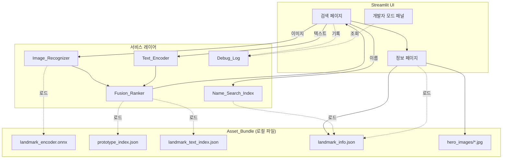
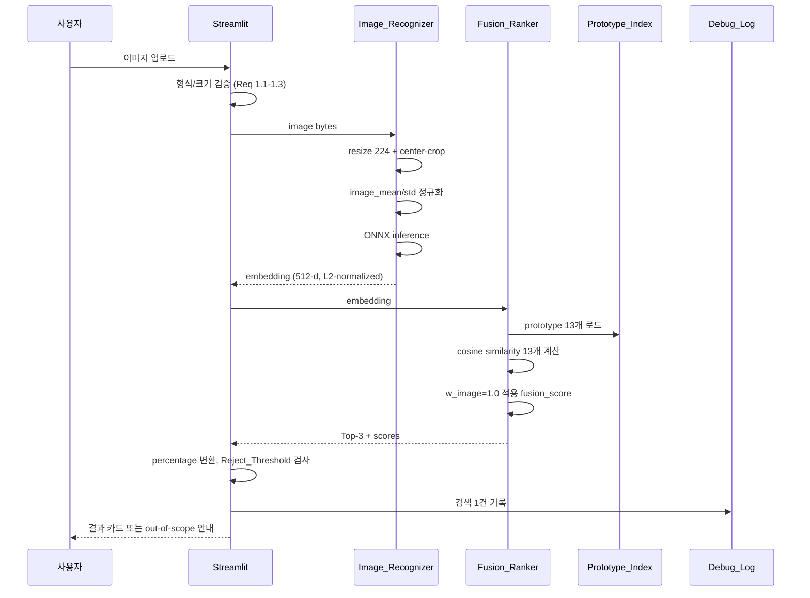
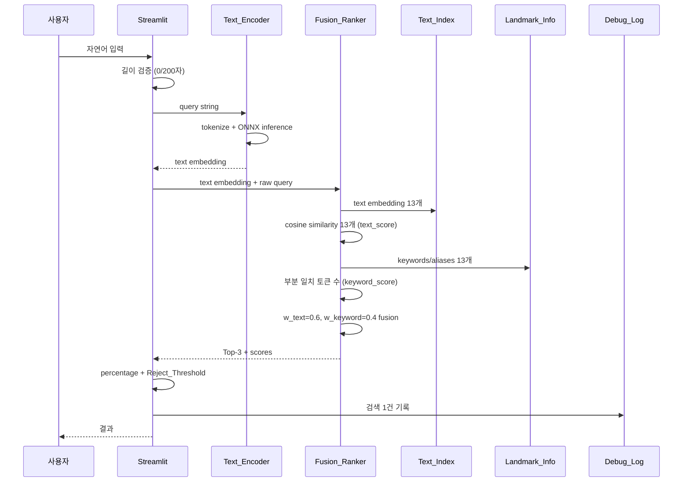
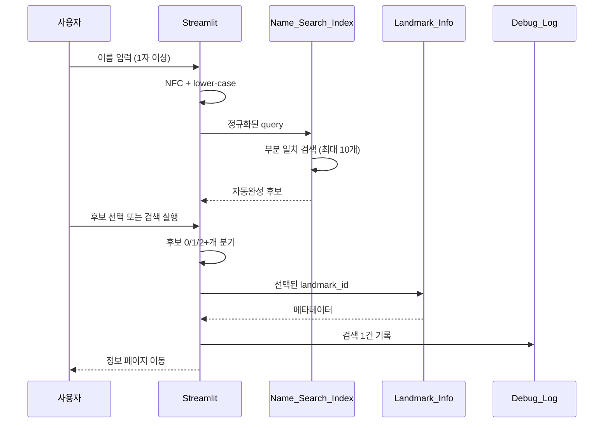
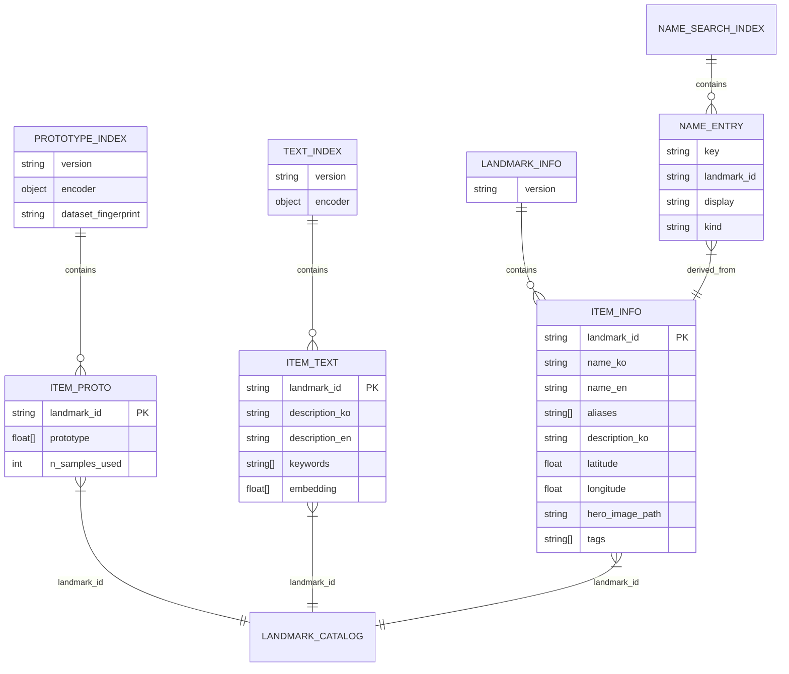
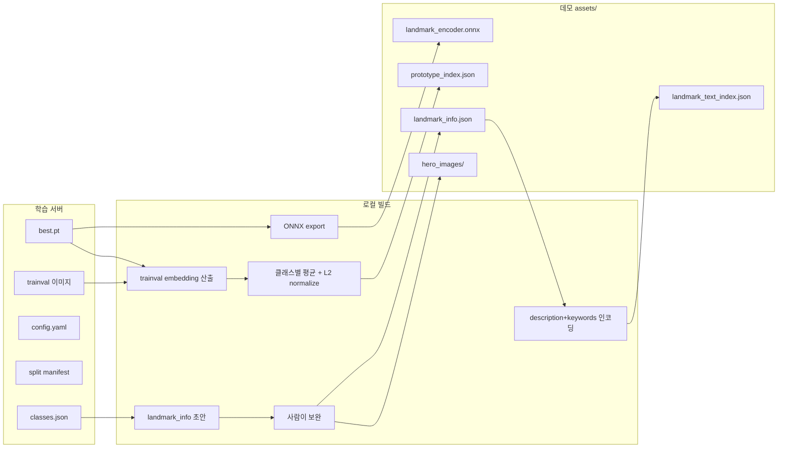

# 기술 설계 문서

## 개요

`landmark-demo-app`은 학습된 MobileCLIP2-S4 image encoder의 ONNX 산출물을 노트북 환경에서 로컬 실행하여, 종로구 13개 한국 전통/문화 랜드마크의 인식·검색 동작을 시연하기 위한 임시 데모 앱이다. ADR-0001 Demo Ladder의 두 번째 단(노트북 ONNX Runtime + 로컬 웹 UI)에 해당하며, 시연일 2026-05-18 이전에 빠른 검증과 시연이 가능한 형태로 구현한다.

본 설계는 `requirements.md`의 7개 요구사항을 직접 구현 가능한 단위로 분해하고, ADR-0001/0003/0004의 결정을 디자인 단계로 풀어낸다. 시연용 임시 산출물이라는 특성을 고려하여 Streamlit 단일 프로세스, 외부 네트워크 의존 0, 자산은 4개 JSON + 1개 ONNX로 정리한다.

## 시스템 아키텍처

### 컴포넌트 구성



### 단일 프로세스 모델

데모는 단일 Python 프로세스로 동작한다. Streamlit 서버가 UI와 비즈니스 로직을 같은 프로세스에서 실행하며, ONNX Runtime 세션은 앱 시작 시 1회 로드 후 재사용한다. 외부 서비스 호출(HTTP, gRPC, DB)은 일체 없다.

## 기술 스택 결정

### 결론

| 분류 | 선택 | 대안 | 근거 |
|---|---|---|---|
| Python | 3.10+ | 3.9 | ONNX Runtime 1.18 권장, 학습 환경과 동일 |
| UI | **Streamlit** | Gradio | multi-page 라우팅, 자동완성 입력, 정보 페이지 레이아웃 자유도 |
| 추론 | ONNX Runtime CPU | PyTorch | 시연 노트북 GPU 없음 가정, 외부 의존 최소화 |
| 이미지 전처리 | Pillow + numpy | torchvision | 데모 의존성 경량화, transforms와 동일 결과 재현 |
| 패키지 관리 | uv 또는 pip + venv | poetry | 학습 레포 관행과 동일 |

### Streamlit vs Gradio

| 항목 | Streamlit | Gradio |
|---|---|---|
| Multi-page | 네이티브 지원 (`pages/`) | 별도 라우팅 필요 |
| 자동완성 입력 | `st.selectbox`로 구현 가능 | 커스텀 JS 필요 |
| 정보 페이지 자유도 | column/container로 자유 배치 | 입출력 인터페이스 중심 |
| 학습 곡선 | 약간 더 가파름 | 매우 낮음 |
| 시연용 데모 | 정보 표시까지 한 화면에 가능 | "ML 모델 인터페이스" 형태 강함 |

본 데모는 단순 입출력이 아니라 정보 페이지·자동완성·개발자 패널 같은 UI 요소가 필요하므로 Streamlit을 채택한다.

## Asset_Bundle 디렉토리 구조

### 디렉토리 레이아웃

```
landmark-demo-app/
└── assets/
    ├── landmark_encoder.onnx          # 학습 산출물 export (~640MB FP32)
    ├── prototype_index.json           # 빌드 파이프라인 생성
    ├── landmark_text_index.json       # 빌드 파이프라인 생성
    ├── landmark_info.json             # 사람이 작성 + 보완
    ├── text_encoder.onnx              # 선택적 (Sprint 2)
    ├── tokenizer.json                 # text_encoder 동반
    └── hero_images/                   # 13개 대표 사진 (사람이 선정)
        ├── bohyunsanshingak.jpg
        ├── changgyeonggung.jpg
        └── ...
```

### prototype_index.json 스키마

```json
{
  "version": "sprint1-v1",
  "encoder": {
    "model_name": "MobileCLIP2-S4",
    "image_size": 224,
    "embedding_dim": 512,
    "image_mean": [0.48145466, 0.4578275, 0.40821073],
    "image_std": [0.26862954, 0.26130258, 0.27577711]
  },
  "dataset_fingerprint": "3bd290fcd8bb73f5b7fe3a0694ef50b1c6597dba",
  "items": [
    {
      "landmark_id": "gwanghwamun",
      "prototype": [/* 512 floats, L2-normalized */],
      "n_samples_used": 44,
      "view_breakdown": {"exterior": 30, "night": 10, "detail": 4}
    }
    // ... 13개
  ]
}
```

### landmark_text_index.json 스키마

```json
{
  "version": "sprint1-v1",
  "encoder": {
    "model_name": "MobileCLIP2-S4-text",
    "embedding_dim": 512
  },
  "items": [
    {
      "landmark_id": "gwanghwamun",
      "description_ko": "광화문은 경복궁의 정문이며 조선 시대 궁궐 건축의 대표 사례다.",
      "description_en": "Gwanghwamun is the main gate of Gyeongbokgung Palace.",
      "keywords": ["광화문", "Gwanghwamun", "경복궁", "정문", "조선왕조"],
      "embedding": [/* 512 floats, L2-normalized, description_ko + description_en + keywords concat 인코딩 결과 */]
    }
  ]
}
```

### landmark_info.json 스키마

```json
{
  "version": "sprint1-v1",
  "items": [
    {
      "landmark_id": "gwanghwamun",
      "name_ko": "광화문",
      "name_en": "Gwanghwamun",
      "aliases": ["경복궁 광화문", "Gyeongbokgung Gate"],
      "description_ko": "광화문은 경복궁의 정문으로, 조선 태조 4년(1395)에 처음 세워졌다. 한국전쟁 중 소실되었다가 2010년 복원되었다.",
      "latitude": 37.5759,
      "longitude": 126.9769,
      "hero_image_path": "hero_images/gwanghwamun.jpg",
      "tags": ["궁궐", "조선왕조", "정문"]
    }
  ]
}
```

## Text Encoder 결정

### 1차 선택: MobileCLIP2-S4 text tower

| 후보 | 장점 | 단점 | Sprint 1 결정 |
|---|---|---|---|
| **MobileCLIP2-S4 text tower** | image encoder와 같은 임베딩 공간, fusion 단순 | 한국어 자유 질의 품질 미검증 | **채택** |
| multilingual-e5-small | 한국어/영어 자연어 강함 | image와 별도 공간이라 fusion 시 정규화 필요, Sprint 1엔 과도 | Sprint 2 옵션 |
| Keyword/BM25 | 가벼움, 명시 특징에 강함 | 동의어/우회 표현 약함 | **fusion에 항상 포함** |

1차 데모에서 자연어 검색이 약하더라도 keyword 매칭이 보완하므로 시연은 충분하다. ADR-0003의 fusion 공식이 이 약점을 흡수하도록 설계됐다.

### Tokenizer

MobileCLIP2-S4 text tower 사용 시 OpenCLIP의 BPE tokenizer를 사용. ONNX 변환은 build 시점에 한 번만 수행하고, 데모 런타임에서는 토크나이저+ONNX session을 함께 호출한다.

## Fusion 가중치 초기값

### 입력 종류별 가중치

| 입력 시나리오 | w_image | w_text | w_keyword | 근거 |
|---|---|---|---|---|
| 이미지 단독 (Req 1) | 1.0 | 0.0 | 0.0 | 텍스트 신호 없음 |
| 텍스트 단독 (Req 2) | 0.0 | 0.6 | 0.4 | text encoder 약점을 keyword가 보완 |
| 이름 검색 (Req 5) | — | — | — | fusion 미사용, Name_Search_Index 직결 |

가중치는 `config.toml`에 외부화하여 시연 중 조정 가능하게 한다. 텍스트-단독 가중치는 시연 직전 holdout 242장으로 30분 정도 calibration해서 최종값 확정.

### 가중치 검증 (Req 2.9)

앱 시작 시점에 가중치 합이 1.0±1e-6, 각 값이 [0.0, 1.0] 범위 안에 있는지 검증한다. 위반 시 fail-fast.

## Image_Recognizer ONNX 세션

### 세션 옵션

```python
import onnxruntime as ort

session_options = ort.SessionOptions()
session_options.graph_optimization_level = ort.GraphOptimizationLevel.ORT_ENABLE_ALL
session_options.intra_op_num_threads = 4
session_options.inter_op_num_threads = 1

session = ort.InferenceSession(
    "assets/landmark_encoder.onnx",
    sess_options=session_options,
    providers=["CPUExecutionProvider"],
)
```

### 입출력

| | shape | dtype | 비고 |
|---|---|---|---|
| 입력 | (1, 3, 224, 224) | float32 | image_mean/std 정규화 후 |
| 출력 logits | (1, 13) | float32 | 데모에서는 무시 |
| 출력 embedding | (1, 512) | float32 | L2-normalized, fusion에 사용 |

### 1초 SLA (Req 1.6)

학습된 MobileCLIP2-S4의 iPhone12 Pro Max 19.6ms 기준 노트북 CPU에서는 약 200~400ms 예상. 1초 SLA는 충분히 통과 가능. 만약 통과 못 하면 INT8 양자화를 Sprint 2 옵션으로 고려.

## PyTorch ↔ ONNX Parity 검증

### 검증 절차

1. 학습 직후 export 시점에 `prepare_for_export()`로 reparameterize 수행
2. 동일 dummy 입력 5장과 실제 검증 이미지 5장을 PyTorch best.pt와 ONNX session에 통과
3. 두 출력의 cosine similarity를 측정
4. 임계: cosine ≥ 0.999 (FP32 수치 오차 허용 범위)

### 실패 시 대응

| 원인 | 대응 |
|---|---|
| reparameterize 누락 | export 전 `prepare_for_export()` 강제 호출 |
| Unsupported op | opset 17 → 18 또는 19로 변경 시도 |
| 부동소수점 누적 오차 | dynamic_axes 제거, 정적 shape으로 재export |

검증 스크립트: `scripts/verify_onnx_parity.py` (자세한 인터페이스는 task에서 정의)

## Name_Search_Index

### 자료구조

13개 클래스에 alias 포함 평균 4-5개 검색 키이므로 약 65개 항목. 단순 리스트 + 문자열 비교로 충분하다.

```python
@dataclass
class NameEntry:
    key: str            # NFC 정규화 + lower-case
    landmark_id: str
    display: str        # 원본 표기
    kind: Literal["name_ko", "name_en", "alias"]

# 검색
def search(query: str, entries: list[NameEntry], limit: int = 10) -> list[NameEntry]:
    q = unicodedata.normalize("NFC", query).lower()
    matches = [e for e in entries if q in e.key]
    matches.sort(key=lambda e: (-len(e.key), e.key))
    return matches[:limit]
```

### 후보 0/1/2+개 분기 (Req 5.7~5.9)

검색 실행 시점의 `len(matches)`로 분기:
- 0개: "검색 결과 없음" 메시지
- 1개: 자동 이동
- 2개 이상이고 사용자가 선택 안 함: "자동완성 목록에서 항목을 선택하세요" 메시지

## Prototype 생성 파이프라인

### 빌드 스크립트 (`scripts/build_assets.py`)

```
입력:
  --run-dir   학습 산출물 디렉토리 (best.pt, classes.json, config.yaml 포함)
  --data-root Dataset 경로
  --split     splits/kfold_seed20260513.json
  --fold      prototype 생성에 사용할 fold (기본값: 0)
  --output    assets/

출력:
  assets/landmark_encoder.onnx
  assets/prototype_index.json
  assets/landmark_text_index.json
```

### 절차

1. best.pt 로드 → 모델 인스턴스화 → reparameterize → ONNX export (이미 export됐으면 skip)
2. trainval split 전체(13 클래스 × 약 60-505 이미지)에 대해 image embedding 산출
3. 클래스별 평균 embedding → L2-normalize → prototype
4. dataset_fingerprint를 split manifest에서 추출하여 메타데이터에 기록
5. text_index 생성: description_ko/en + keywords 문자열을 text encoder로 인코딩

### Test set 격리

prototype 생성에 **test set은 사용하지 않는다.** ADR-0001 정책에 따라 test는 최종 평가용으로 격리. trainval만 사용해 prototype을 만든다.

### View 가중 평균 (선택)

소수 클래스(gwanghwamun 44장)는 view_type별로 prototype을 따로 만들지, 단일 평균으로 갈지 검토 가능. Sprint 1 데모는 단일 평균으로 충분.

## landmark_info.json 초기 콘텐츠

### 출처

| 필드 | 출처 |
|---|---|
| landmark_id | classes.json (학습 산출물) |
| name_ko, name_en | labels_master.json의 landmark_name_ko/en |
| aliases | 사람이 추가 (예: "경복궁 광화문", "Gyeongbokgung Gate") |
| description_ko | 사람이 직접 작성 (100~200자, 위키 인용 회피) |
| latitude, longitude | Google Maps 직접 입력 |
| hero_image_path | trainval 이미지 중 quality_status=ok, view_type=exterior인 대표 1장 사람 선정 |
| tags | 사람이 추가 (예: "궁궐", "조선왕조") |

### 작성 도우미 스크립트 (`scripts/seed_landmark_info.py`)

labels_master.json에서 13개 클래스의 name_ko/en을 자동으로 추출하여 빈 description/위경도/aliases 필드를 갖는 초안 JSON을 생성. 사람이 채워 넣는 식.

### 위키 인용 정책

위키 본문 직접 복사는 라이선스 검토 필요(CC-BY-SA). Sprint 1 데모는 사람이 직접 100자 내외로 짧게 작성하여 회피. 시연 후 정식 콘텐츠는 별도 결정.

## Reject_Threshold 0.25

### 가설

학습된 MobileCLIP2-S4의 cosine similarity 분포 가설:
- 정상 입력: prototype과 cosine 0.4 이상
- 무관 입력: prototype과 cosine 0.1 이하
- 0.25는 두 분포 사이 추정 중간값

### Calibration 계획

시연 전 30분~1시간 작업:
1. holdout_non_confirmed 242장으로 모델 추론
2. 각 이미지의 1순위 cosine similarity 분포 그래프
3. 정상 분포(test 669장)와 holdout 분포의 ROC 분석으로 최적 threshold 산출
4. config.toml의 reject_threshold 갱신

### Calibration 미수행 시

기본값 0.25로 시연 가능. 시연 중 false reject가 자주 발생하면 0.20으로 즉시 조정.

## Debug_Log JSONL 스키마

```json
{
  "timestamp": "2026-05-18T10:23:45.123+09:00",
  "kind": "image",
  "input_id": "demo_photo_03.jpg",
  "elapsed_ms": 312,
  "below_threshold": false,
  "top3": [
    {"landmark_id": "gwanghwamun", "fusion_score": 0.84, "rank": 1},
    {"landmark_id": "gyeongbokgung_geunjeongmun", "fusion_score": 0.62, "rank": 2},
    {"landmark_id": "deoksugung", "fusion_score": 0.41, "rank": 3}
  ],
  "scores": {
    "image": {"gwanghwamun": 0.84, /* ... 13개 */},
    "text": null,
    "keyword": null
  }
}
```

### 회전 정책

Sprint 1 데모 범위에서는 단일 파일 누적. 시연 종료 후 사람이 수동으로 archive. 자동 rotation은 Sprint 2.

## 모듈/파일 구조

```
landmark-demo-app/
├── pyproject.toml
├── README.md
├── config.toml                    # fusion 가중치, threshold, 자산 경로
├── .gitignore                     # assets/, logs/ 제외
├── assets/                        # 빌드 산출물
├── logs/                          # 실행 로그
├── scripts/
│   ├── build_assets.py
│   ├── verify_onnx_parity.py
│   └── seed_landmark_info.py
├── src/
│   └── landmark_demo/
│       ├── __init__.py
│       ├── app.py                 # Streamlit entry point
│       ├── config.py              # config.toml 로드 + 검증
│       ├── pages/
│       │   ├── __init__.py
│       │   ├── search.py          # 이미지/텍스트/이름 검색 통합 화면
│       │   └── landmark.py        # 정보 페이지
│       ├── inference/
│       │   ├── __init__.py
│       │   ├── image_recognizer.py
│       │   ├── text_encoder.py
│       │   └── fusion.py
│       ├── data/
│       │   ├── __init__.py
│       │   ├── asset_loader.py    # Asset_Bundle 로드 + 검증 (Req 6)
│       │   ├── prototype_index.py
│       │   ├── text_index.py
│       │   ├── landmark_info.py
│       │   └── name_search.py
│       ├── logging/
│       │   ├── __init__.py
│       │   └── debug_log.py
│       └── ui/
│           ├── __init__.py
│           ├── components.py      # 결과 카드, 정보 페이지 위젯
│           └── styles.py          # Streamlit 커스텀 CSS
└── tests/
    ├── test_asset_loader.py
    ├── test_fusion.py
    ├── test_name_search.py
    └── test_image_preprocess.py
```

## 흐름도

### 이미지 검색 시퀀스 (Req 1)



### 텍스트 검색 시퀀스 (Req 2)



### 이름 검색 시퀀스 (Req 5)



## 데이터 모델 관계



## 빌드 파이프라인 (학습 산출물 → 데모 자산)



## 시연 Ladder 우선순위

| 순위 | 환경 | Sprint 1 본 데모 | Sprint 2 |
|---|---|---|---|
| 1 | 휴대폰 ONNX Runtime Mobile | ❌ 미포함 | ✅ |
| 2 | 노트북 ONNX Runtime + Streamlit | ✅ **본 데모 1차 목표** | — |
| 3 | Flutter shell | ❌ 미포함 | ✅ |
| 4 | Python local demo (CLI) | ✅ 자동 fallback | — |

본 데모는 ADR-0001의 두 번째 단(노트북 ONNX Runtime + 로컬 웹 UI) 구현이며, 휴대폰 ladder는 명시적으로 Sprint 2로 미룬다.

## 트레이스빌리티 매트릭스

| 요구사항 | 디자인 영역 |
|---|---|
| Req 1 (이미지 인식) | Image_Recognizer ONNX 세션, 전처리 파이프라인 |
| Req 2 (자연어 검색) | Text_Encoder, Fusion_Ranker, 가중치 검증 |
| Req 3 (Top-3 + Out-of-Scope) | Fusion_Ranker, Reject_Threshold calibration, UI 토글 |
| Req 4 (정보 페이지) | landmark_info.json 스키마, coordinates_valid 검증 |
| Req 5 (이름 검색) | Name_Search_Index, 후보 0/1/2+개 분기 |
| Req 6 (자산 + 런타임) | Asset_Bundle 디렉토리, asset_loader.py 검증, Streamlit 채택 |
| Req 7 (디버그 + 보조) | Debug_Log JSONL, 개발자 모드 패널, 5초 지연 알림 |

## 위험 및 완화

| 위험 | 영향 | 완화 |
|---|---|---|
| ONNX export 실패 (reparameterize 누락) | 데모 자체 차질 | export 직후 parity 검증, 실패 시 best.pt + PyTorch fallback 모드 |
| 한국어 자유 질의 품질 저조 | 텍스트 검색 시연 가치 저하 | keyword_score로 보완, 시연 시 자연어 예시는 영어 중심 권장 |
| Reject_Threshold 미보정 | false reject 빈발 | calibration 30분 작업, 실패 시 기본 0.25 → 0.20 즉시 조정 |
| 노트북 CPU 추론 1초 초과 | Req 1.6 미충족 | INT8 양자화 옵션 보유, 시연 노트북에서 사전 측정 |
| landmark_info description 작성 부담 | 13 × 100자 = 약 1,300자 | seed 스크립트로 골격 생성 후 사람이 30분 안에 채움 |

## Sprint 1 외 명시적 비포함

- 휴대폰 ONNX Runtime Mobile 빌드
- Flutter UI
- 사용자 인증
- 멀티유저 동시 접속
- 모델 자동 업데이트
- INT8 양자화 (필요 시 추가)
- 자동 시각화 confusion matrix UI
- A/B 비교 (MobileNetV4 fallback)

이들은 모두 Sprint 2 또는 별도 결정 사항.
